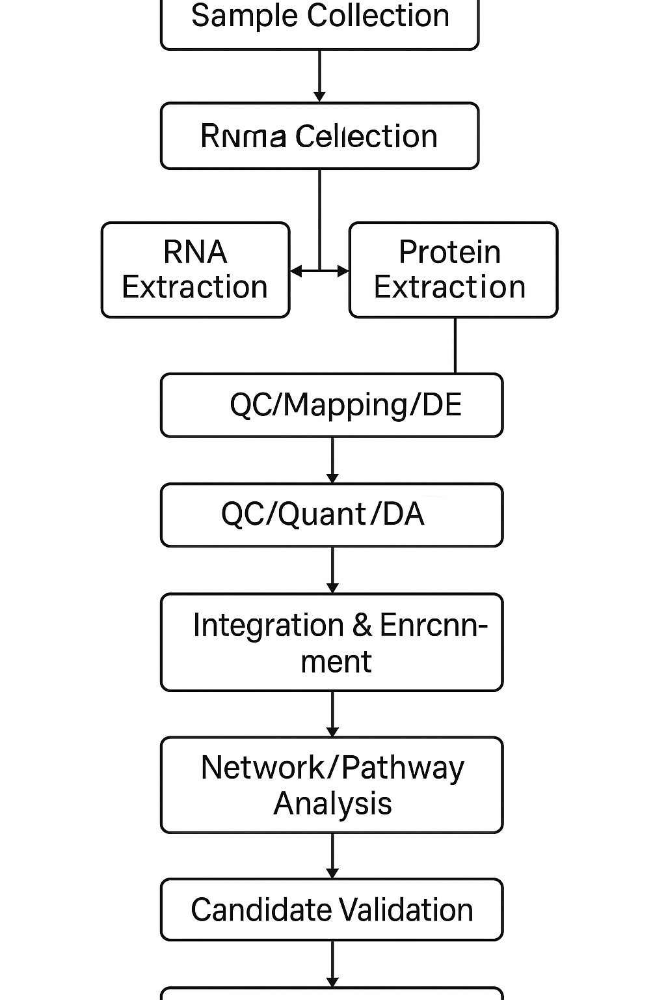

# Workflow

1. Literature & database mining for candidate genes
2. RNA-seq: QC → alignment → quantification → DE analysis
3. Proteomics: processing → quantification → DE analysis
4. Gene-protein mapping
5. Pathway/enrichment/network analysis
6. Candidate validation (wet lab and in silico)

